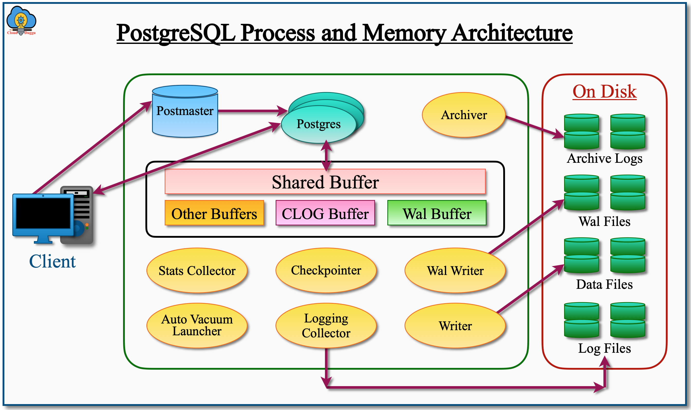

# **Mengenal PostgreSQL 14**

PostgreSQL adalah server basis data berbasis SQL yang canggih dan dapat digunakan di berbagai platform. Salah satu keunggulan utamanya adalah bersifat *open source* (sumber terbuka), artinya Anda bebas menginstal, menggunakan, dan menyebarkan PostgreSQL tanpa harus membayar biaya atau royalti kepada siapa pun. 

PostgreSQL dikenal sebagai basis data yang stabil, mampu berjalan lama tanpa perlu dimatikan, dan umumnya membutuhkan sedikit atau bahkan tanpa perawatan sama sekali. Secara keseluruhan, PostgreSQL menawarkan biaya kepemilikan yang sangat rendah.

Dikembangkan selama lebih dari 30 tahun secara berkelanjutan, PostgreSQL memiliki banyak fitur canggih. Awalnya dibuat oleh Kelompok Penelitian Basis Data di University of California, Berkeley, kini PostgreSQL dikembangkan oleh komunitas besar pengembang dan kontributor. Banyak dari mereka bekerja penuh waktu sebagai perancang sistem, pengembang perangkat lunak, administrator basis data, maupun pelatih. Sebagian kecil bekerja di perusahaan yang khusus menyediakan dukungan untuk PostgreSQL.

Tidak ada satu perusahaan pun yang memiliki PostgreSQL sepenuhnya, dan Anda tidak diwajibkan — bahkan tidak didorong — untuk mendaftarkan penggunaan PostgreSQL.

## **Fitur Utama PostgreSQL**

- **Kompatibilitas tinggi dengan standar SQL**, hingga standar SQL:2016.  
- **Arsitektur client-server**, memungkinkan klien terhubung dari jarak jauh.  
- **Dirancang untuk konkurensi tinggi**, di mana pembaca dan penulis data tidak saling menghalangi.  
- **Sangat fleksibel dan dapat dikembangkan**, cocok untuk berbagai jenis aplikasi.  
- **Skalabilitas dan kinerja tinggi**, dilengkapi berbagai opsi penyetelan (tuning).  
- **Dukungan berbagai model data**, seperti:  
  - Data relasional (tabel biasa),  
  - Data pasca-relasional (array, relasi bersarang melalui tipe rekaman),  
  - Data dokumen (JSON, XML),  
  - Data kunci-nilai (key/value).

Dengan semua fitur ini, PostgreSQL menjadi pilihan yang kuat dan andal untuk berbagai kebutuhan penyimpanan dan pengelolaan data.

---

# **Apa yang Membuat PostgreSQL Berbeda?**

Proyek PostgreSQL fokus pada empat tujuan utama:

- Menghasilkan perangkat lunak yang **kuat dan berkualitas tinggi** dengan kode yang rapi dan terdokumentasi.  
- **Perawatan rendah**, baik untuk penggunaan kecil (embedded) maupun skala besar (enterprise).  
- Kepatuhan terhadap **standar SQL**, interoperabilitas, dan kompatibilitas.  
- **Kinerja, keamanan, dan ketersediaan tinggi**.

Banyak orang terkejut mengetahui bahwa fitur-fitur PostgreSQL lebih mirip Oracle atau SQL Server daripada MySQL. Satu-satunya kesamaan antara MySQL dan PostgreSQL adalah keduanya *open source*. Selebihnya, filosofi dan fitur keduanya sangat berbeda.

Salah satu fitur unggulan Oracle sejak Oracle 7 adalah *snapshot isolation*, yaitu pembaca tidak menghalangi penulis dan sebaliknya. Namun, **PostgreSQL justru yang pertama kali dirancang dengan fitur ini**. Di PostgreSQL, fitur ini disebut **MVCC (Multiversion Concurrency Control)**, yang akan dibahas lebih lanjut nanti.

PostgreSQL adalah sistem manajemen basis data serbaguna. Anda bisa menentukan sendiri bagaimana basis data dikelola. PostgreSQL memberi banyak pilihan:

- Gunakan model basis data terstruktur (normalisasi) dengan tambahan fitur seperti *array* dan tipe rekaman.  
- Gunakan skema fleksibel dengan **JSONB** atau ekstensi **hstore**.  
- Buat fungsi server-side dalam lebih dari satu lusin bahasa, seperti Python, Perl, JavaScript, dan lainnya.

---

## **Contoh Penggunaan JSONB dan hstore**

### 1. **Contoh Penggunaan JSONB**

**JSONB** adalah tipe data biner untuk menyimpan dokumen JSON secara efisien, mendukung indeks dan pencarian cepat.

#### 📌 Contoh Kasus
Menyimpan data profil pengguna yang fleksibel tanpa membuat kolom baru setiap kali ada atribut tambahan.

#### 💡 Buat tabel:
```sql
CREATE TABLE pengguna (
    id serial PRIMARY KEY,
    nama text,
    data_lain jsonb
);
```

#### 💡 Masukkan data:
```sql
INSERT INTO pengguna (nama, data_lain) VALUES
('Andi', '{
    "hobi": ["membaca", "bersepeda"],
    "alamat": "Jakarta",
    "notifikasi": true,
    "umur": 28
}');
```

#### 💡 Ambil data tertentu:
```sql
-- Cari pengguna yang hobi-nya bersepeda
SELECT nama FROM pengguna 
WHERE data_lain->'hobi' ? 'bersepeda';
```
> Hasil: `Andi`

---

### 2. **Contoh Penggunaan hstore**

**hstore** adalah ekstensi PostgreSQL untuk menyimpan pasangan **kunci-nilai** (`key => value`), mirip dengan kamus (dictionary).

#### 💡 Aktifkan ekstensi:
```sql
CREATE EXTENSION IF NOT EXISTS hstore;
```

#### 💡 Buat tabel:
```sql
CREATE TABLE produk (
    id serial PRIMARY KEY,
    nama text,
    atribut hstore
);
```

#### 💡 Masukkan data:
```sql
INSERT INTO produk (nama, atribut) VALUES
('Laptop', '("warna" => "hitam", "ram" => "16GB", "tipe" => "gaming")'),
('Mouse', '("warna" => "putih", "baterai" => "rechargeable")');
```

#### 💡 Ambil data:
```sql
-- Cari produk berwarna hitam
SELECT nama FROM produk 
WHERE atribut->'warna' = 'hitam';
```
> Hasil: `Laptop`

```sql
-- Tampilkan semua atribut laptop
SELECT atribut FROM produk WHERE nama = 'Laptop';
```
> Hasil: `"warna"=>"hitam", "ram"=>"16GB", "tipe"=>"gaming"`

---

### 🔎 Perbedaan Singkat: JSONB vs hstore

| Fitur | JSONB | hstore |
|------|-------|--------|
| Format | JSON (struktur bersarang) | Kunci-nilai sederhana |
| Tipe Data | String, angka, array, boolean, objek | Hanya string |
| Indeks | Didukung (GIN), sangat cepat | Didukung |
| Fleksibilitas | Tinggi, cocok untuk data kompleks | Rendah, cocok untuk metadata sederhana |

---

### ✅ Kapan Harus Menggunakan Apa?

- **Gunakan JSONB** jika:  
  Anda perlu menyimpan data bersarang seperti profil, pengaturan, atau dokumen dengan struktur kompleks.

- **Gunakan hstore** jika:  
  Anda hanya butuh menyimpan pasangan kunci-nilai sederhana, seperti tag atau konfigurasi cepat.

> Dengan keduanya, PostgreSQL bisa berfungsi seperti **database NoSQL**, sekaligus tetap menjadi **database relasional** yang kuat. Inilah yang membuatnya sangat fleksibel!

---

## **Ekstensibilitas (Kemampuan Dikembangkan)**

PostgreSQL dirancang sangat ekstensibel. Anda bisa:

- Menambahkan tipe data, operator, atau indeks baru.  
- Membuat bahasa pemrograman server sendiri.  
- Menggunakan *plugin* untuk mengubah cara eksekusi perintah atau menambah *optimizer* kueri.

Fitur `CREATE EXTENSION` memudahkan penambahan ekstensi dengan otomatisasi versi dan ketergantungan.

Contoh ekstensi populer:
- **PostGIS**: Sistem Informasi Geografis (GIS) kelas dunia untuk aplikasi peta dan analisis lokasi.

---

## **Kinerja dan Konkurensi**

PostgreSQL 14 mampu mencapai:
- **Lebih dari 1 juta pembacaan per detik** pada server 4 soket CPU.  
- **Lebih dari 30.000 transaksi penulisan per detik** dengan jaminan *durability* (data tidak hilang).

Dengan **optimizer canggih** dan **MVCC**, PostgreSQL memungkinkan banyak pengguna membaca dan menulis secara bersamaan tanpa saling mengganggu.

PostgreSQL juga mendukung **berbagai jenis indeks**, lebih banyak daripada database lain, dan mendukung semua tipe data secara penuh.

Gabungan fitur ini memungkinkan PostgreSQL menangani **campuran beban kerja**: transaksi, analisis, dan pencarian kompleks — **semua dalam satu sistem**.

> Artinya, Anda **tidak perlu memindahkan data** ke gudang data hanya untuk kueri ad hoc. Ini menghemat waktu, sumber daya, dan risiko kesalahan.

---

## **Skalabilitas**

- **Skalabilitas vertikal**: PostgreSQL 14 bekerja sangat baik hingga 4 soket CPU.  
- Dengan *session pool*, bisa menangani ratusan sesi aktif dan ribuan koneksi.  
- Skalabilitas terus ditingkatkan setiap rilis tahunan.

- **Skalabilitas baca (read)**: Didukung melalui fitur *hot standby*.  
- **Skalabilitas tulis (write)**: Sedang dikembangkan, berbasis **replikasi dua arah (Bi-directional Replication)**.

---

## **Dukungan Model Data: SQL dan NoSQL**

PostgreSQL mendukung berbagai model data dalam satu basis data:

- **Relasional**: Dari 3NF hingga *star schema*.  
- **Pasca-relasional**: Array, tipe baris, tipe rentang.  
- **Dokumen**: JSONB, XML, teks — dilengkapi indeks dan pencarian teks lengkap.  
- **Key/Value**: Dengan ekstensi **hstore**.

---

## **Populer di Seluruh Dunia**

PostgreSQL digunakan oleh banyak perusahaan besar, seperti:
- Apple, Skype, McAfee, Heroku, IMDB, NTT, BASF, Genentech  
- UK Met Office, US National Weather Service

Pada 2010, PostgreSQL telah diunduh lebih dari 1 juta kali per tahun. Komisi Eropa menyatakan bahwa *"PostgreSQL dianggap sebagai alternatif yang bisa diandalkan."*

Dr. Werner Vogels, **CTO Amazon Web Services (AWS)**, menyebut PostgreSQL sebagai *"database yang luar biasa"* dan *"pilihan utama bagi pengembang perusahaan dan startup."* AWS juga mengumumkan bahwa PostgreSQL adalah layanan mereka yang **paling cepat berkembang**.

---

## **Dukungan Komersial**

Meski *open source*, PostgreSQL memiliki dukungan profesional global dari berbagai perusahaan, seperti:

- **EnterpriseDB (EDB)**: Perusahaan terbesar penyedia dukungan komersial, tempat penulis buku ini bekerja. Menyediakan dukungan 24/7 dalam bahasa Inggris.
- Banyak perusahaan lain menyediakan dukungan lokal, vertikal, atau teknis khusus.

PostgreSQL juga tersedia sebagai **layanan cloud** (managed service) dari AWS, Google Cloud, Azure, dan penyedia lainnya.

Daftar lengkap penyedia dukungan:  
[http://www.postgresql.org/support/professional_support/](http://www.postgresql.org/support/professional_support/)

---

## **Pendanaan untuk Penelitian dan Pengembangan**

PostgreSQL dimulai sebagai proyek penelitian di **University of California, Berkeley**, pada akhir 1980-an. Pengembangan dilanjutkan oleh relawan hingga akhir 1990-an, sebelum akhirnya pengembang profesional dan perusahaan mulai terlibat.

Pendanaan penelitian datang dari:
- **NSF (National Science Foundation)** – Amerika Serikat  
- **Program FP7 Uni Eropa**, melalui dua proyek:
  1. **4CaaST**: Fokus pada *cloud computing*.  
  2. **AXLE**: Fokus pada analisis data skala besar.

### 🌟 Proyek AXLE

Berlangsung selama tiga tahun, AXLE bertujuan memperkuat kemampuan PostgreSQL dalam **kecerdasan bisnis (business intelligence)** untuk database sangat besar. Lingkup proyek meliputi:

- Keamanan dan privasi data  
- Integrasi dengan *data mining*  
- Alat visualisasi data (dashboard, grafik)  
- Optimasi untuk perangkat keras baru

Informasi lebih lanjut:  
[https://axleproject.eu/](https://axleproject.eu/)

Selain pendanaan publik, pengembangan PostgreSQL juga didukung oleh:
- **Pengguna yang mendanai fitur tertentu**  
- **Perusahaan** yang menjual produk/layanan berbasis PostgreSQL

Banyak fitur baru dikontribusikan oleh perusahaan besar seperti **EDB**, menjadikan PostgreSQL sistem basis data yang terus berkembang dan siap untuk masa depan.

---

# **Kesimpulan**

PostgreSQL bukan sekadar database *open source*. Ia andal, aman, fleksibel, dan kuat — cocok untuk aplikasi dari skala kecil hingga infrastruktur global. Dengan dukungan komunitas, perusahaan, dan inovasi berkelanjutan, PostgreSQL adalah **pilihan cerdas untuk sekarang dan masa depan**.

---

> **Catatan Nama**:  
> PostgreSQL awalnya bernama **Postgres**. Karena itu, banyak bagian sistem masih menggunakan nama tersebut (misalnya database default `postgres`). Banyak orang menyebutnya **Postgres**, dan kedua nama ini sering digunakan secara bergantian.  
> - *PostgreSQL* diucapkan: **post-grez-kyu-el**  
> - *Postgres* diucapkan: **post-grez**  
> Hindari menyebut *Postgre* — itu membingungkan. Cukup gunakan **PostgreSQL** atau **Postgres**.


# **Arsitektur PostgreSQL (Penjelasan Mudah Dipahami)**

PostgreSQL adalah sistem basis data **open source** yang canggih, pertama kali dikembangkan pada 8 Juli 1996 di University of California, Berkeley. Sejak itu, terus diperbarui dan ditingkatkan oleh komunitas pengembang aktif dari seluruh dunia.

PostgreSQL menggunakan **model client-server**, artinya:

- Anda (pengguna) mengirim permintaan lewat aplikasi atau alat (client).
- Server PostgreSQL menerima permintaan, memprosesnya, lalu mengirim hasilnya kembali ke Anda.
- Setiap koneksi dari client akan membuat **proses baru di server** yang disebut `postgres`.
- Port default untuk koneksi ini adalah **5432**, tapi bisa diubah lewat file konfigurasi `postgresql.conf`.

---

## **Komponen Utama Arsitektur PostgreSQL**

 <div align="left">
        
    </div>

Berikut adalah bagian-bagian penting dari cara kerja PostgreSQL:

---

### 1. **Postmaster – Pengawas Utama**

- **Apa fungsinya?**  
  Ini adalah proses **pertama** yang dijalankan saat PostgreSQL dinyalakan. Ia bertindak sebagai "receptionist" atau pengawas.
  
- **Tugas utama:**
  - Menerima koneksi dari client (pengguna).
  - Memeriksa login dan izin (otentikasi).
  - Membuat proses baru (`postgres`) untuk setiap koneksi.
  - Memantau proses-proses tersebut dan menjalankannya kembali jika macet.

> 🔹 Bayangkan Postmaster seperti **satpam utama gedung** yang mengatur siapa saja yang boleh masuk dan memberi penjaga khusus untuk setiap tamu.

---

### 2. **Shared Memory – Memori Bersama**

Ini adalah area memori (RAM) yang digunakan oleh PostgreSQL untuk menyimpan data sementara agar lebih cepat diakses. Terdiri dari beberapa bagian:

#### 2.1 **Shared Buffer**  
- Tempat menyimpan **salinan data dari tabel dan indeks** yang sedang digunakan.
- Jika Anda membaca data, PostgreSQL pertama cek di sini sebelum baca dari disk (yang lebih lambat).
- Diatur lewat parameter: `shared_buffers` di file `postgresql.conf`.

> 💡 Semakin besar `shared_buffers`, semakin cepat akses data — tapi jangan terlalu besar.

#### 2.2 **WAL Buffer (Write-Ahead Log Buffer)**  
- Menyimpan **catatan perubahan data** sebelum benar-benar disimpan di disk.
- Fungsinya: **jika server mati tiba-tiba, data tidak hilang**.
- Dikelola oleh parameter: `wal_buffers`.

> 🔐 Ini seperti **catatan sementara** sebelum Anda menyimpan dokumen penting.

#### 2.3 **CLOG Buffer (Commit Log)**  
- Menyimpan informasi: **apakah suatu transaksi sudah selesai (commit) atau belum**.
- Tidak perlu diatur manual — sistem mengelolanya otomatis.

#### 2.4 **Work Memory**  
- Digunakan untuk operasi seperti:
  - Mengurutkan data (`ORDER BY`)
  - Menggabungkan tabel (`JOIN`)
  - Menghitung grup (`GROUP BY`)
- Diatur lewat: `work_mem`
- **Hati-hati:** Jika terlalu besar, bisa habiskan semua RAM karena dialokasikan per operasi.

#### 2.5 **Maintenance Work Memory**  
- Digunakan untuk tugas pemeliharaan seperti:
  - Membuat indeks (`CREATE INDEX`)
  - Membersihkan data (`VACUUM`)
- Diatur lewat: `maintenance_work_mem`
- Boleh lebih besar dari `work_mem` karena jarang digunakan.

#### 2.6 **Temp Buffers**  
- Digunakan saat Anda membuat **tabel sementara**.
- Hanya berlaku untuk satu sesi (koneksi).
- Diatur lewat: `temp_buffers`

---

### 3. **Proses Latar Belakang (Background Processes)**

Proses-proses ini berjalan otomatis untuk menjaga PostgreSQL tetap stabil, cepat, dan aman.

#### 3.1 **Background Writer**  
- Tugas: Menulis data yang sudah diubah (**dirty pages**) dari `shared buffer` ke file di disk.
- Agar selalu ada ruang kosong di memori untuk data baru.
- Dikontrol oleh:
  - `bgwriter_delay`: jeda antar penulisan (default 200ms)
  - `bgwriter_lru_maxpages`: jumlah maks halaman yang ditulis
  - `bgwriter_lru_multiplier`: prediksi berapa banyak data baru akan masuk

#### 3.2 **Checkpointer**  
- Saat tertentu, PostgreSQL menyimpan **semua perubahan dari memori ke disk** — ini disebut **checkpoint**.
- Tujuannya: mempercepat pemulihan jika terjadi crash.
- Checkpoint terjadi saat:
  - Waktu tertentu (default tiap 5 menit)
  - Jumlah log WAL sudah penuh
  - Anda membuat/menghapus database
  - Anda jalankan perintah `CHECKPOINT`

> 🔄 Setelah checkpoint, PostgreSQL tahu dari mana harus mulai memulihkan data jika terjadi kesalahan.

#### 3.3 **Autovacuum Launcher**  
- Membersihkan data yang sudah dihapus agar tidak memenuhi ruang.
- Contoh: Jika Anda `DELETE` data, PostgreSQL tidak langsung menghapusnya dari file — Autovacuum yang membersihkannya.
- Aktif otomatis. Sangat penting untuk kinerja jangka panjang.

#### 3.4 **WAL Writer**  
- Menulis isi **WAL Buffer** ke file WAL di disk setelah `COMMIT`.
- Memastikan perubahan tersimpan permanen.

#### 3.5 **Statistics Collector**  
- Mengumpulkan data statistik:
  - Berapa banyak baris di tabel?
  - Indeks mana yang sering digunakan?
  - Bagaimana pola akses pengguna?
- Data ini digunakan oleh **optimizer** untuk memilih cara terbaik menjalankan kueri.

> 📊 Anda bisa lihat statistiknya dengan perintah:  
> ```sql
> \d pg_stat
> ```

#### 3.6 **Logging Collector**  
- Mengumpulkan semua pesan log (error, peringatan, info) dan menyimpannya di file log.
- Diaktifkan dengan pengaturan:
  ```conf
  logging_collector = on
  log_directory = 'pg_log'
  ```

#### 3.7 **Archiver**  
- Jika mode *archive* aktif, proses ini menyalin file WAL ke lokasi cadangan.
- Berguna untuk **pemulihan bencana (disaster recovery)**.

---

### 4. **File Fisik – Penyimpanan Data di Disk**

PostgreSQL menyimpan data nyata dalam beberapa jenis file:

#### 4.1 **Data Files**  
- File yang menyimpan **data tabel, indeks, dan objek basis data**.
- Saat Anda baca data, PostgreSQL ambil dari sini (jika tidak ada di `shared buffer`).

#### 4.2 **WAL Files (Write-Ahead Log)**  
- Menyimpan **semua perubahan** sebelum ditulis ke data file.
- Jika terjadi crash, PostgreSQL bisa "memutar ulang" perubahan dari sini.
- Sangat penting untuk **keandalan dan pemulihan data**.

#### 4.3 **Log Files**  
- Menyimpan catatan aktivitas server:
  - Error, peringatan, info, query lambat, dll.
- Lokasi: biasanya di folder `pg_log`.
- Berguna untuk **troubleshooting**.

#### 4.4 **Archive Logs**  
- Salinan dari file WAL yang sudah penuh.
- Digunakan untuk **Point-in-Time Recovery (PITR)** — memulihkan database ke waktu tertentu.

---

## ✅ Ringkasan Singkat

| Komponen | Fungsi Utama |
|---------|-------------|
| **Postmaster** | Pengawas, menerima koneksi dan buat proses baru |
| **Shared Buffer** | Cache data agar cepat diakses |
| **WAL Buffer & Files** | Catat perubahan untuk keamanan data |
| **Work Mem** | Bantu pengurutan dan penggabungan data |
| **Background Writer** | Simpan data dari memori ke disk |
| **Checkpointer** | Titik pemulihan saat terjadi crash |
| **Autovacuum** | Bersihkan sampah data |
| **Stats Collector** | Kumpulkan statistik untuk optimasi |
| **Data Files** | Simpan data utama |
| **Log Files** | Catat aktivitas server |
| **Archive Logs** | Backup log untuk pemulihan |

---

## 🎯 Kenapa Arsitektur Ini Penting?

- **Cepat**: Gunakan memori untuk akses data.
- **Aman**: Selalu catat perubahan sebelum disimpan.
- **Stabil**: Bisa pulih dari crash.
- **Skalabel**: Bisa tangani banyak koneksi dan data besar.

---

Dengan arsitektur yang kuat dan fleksibel seperti ini, wajar jika PostgreSQL dipakai oleh perusahaan besar seperti **Apple, Skype, AWS**, dan proyek riset seperti **AXLE** untuk analisis data sangat besar.

> 🌐 Pelajari lebih lanjut: [https://axleproject.eu/](https://axleproject.eu/)